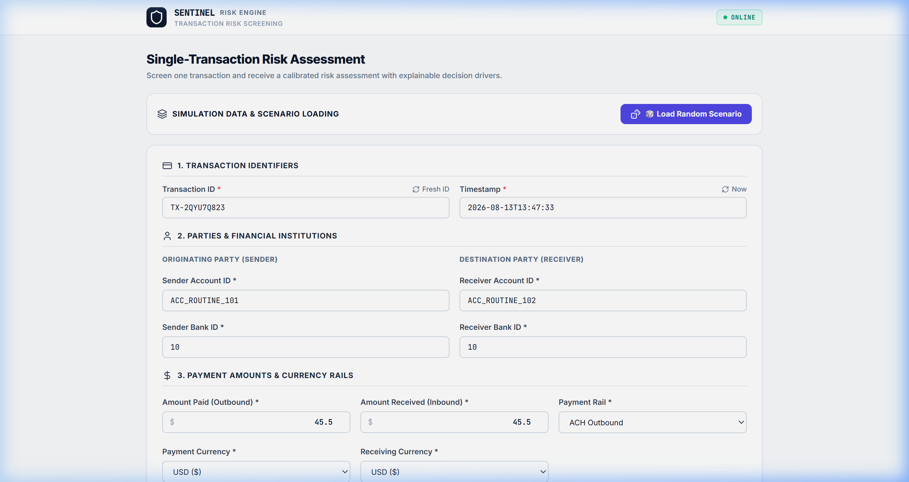
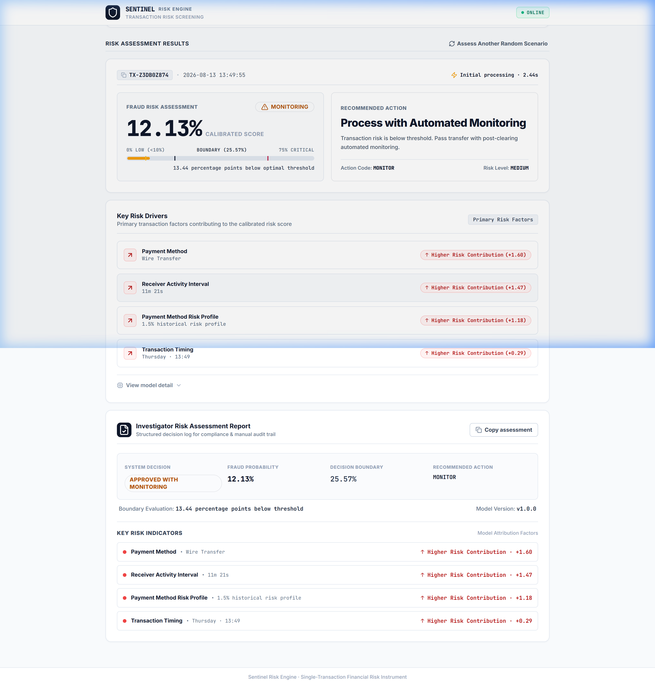

# 🛡️ SENTINEL RISK ENGINE
### Real-Time Financial Transaction Fraud Screening & Explainability Instrument

[](https://sentinelhg.vercel.app/)
[](https://www.python.org/)
[](https://fastapi.tiangolo.com/)
[](https://nextjs.org/)
[](models/champion/)
[](docker-compose.yml)
[](https://www.postgresql.org/)
[](docs/deployment/08_arm64_compatibility_audit.md)
[](docs/deployment/08_final_production_safety_audit.md)

---

## 🖥️ Workstation Interface Showcase

| Single-Transaction Risk Screening Form | Calibrated Risk Assessment & SHAP Drivers |
| :---: | :---: |
|  |  |

---

## 📌 Executive Product Overview

**Sentinel Risk Engine** is a single-transaction financial fraud screening instrument designed for high-throughput banking environments. Given **11 raw transaction fields**, the backend executes online feature engineering across prior account history, standardizes a **61-feature vector**, scores the transaction with an Optuna-tuned **LightGBM Champion Model**, calibrates probabilities using **Isotonic Regression**, evaluates an **unrounded decision threshold (`0.2556561085972851`)**, and computes **TreeSHAP risk drivers** for instant investigator transparency.

### Key Architectural Invariants
- **Strict Anti-Dashboard Rule**: Zero noise, zero sidebars, zero trend grids—100% focused on single-transaction risk assessment.
- **11-Field Public Contract**: Frontend submits *only* raw transaction details; feature engineering, scaling, SHAP, and decisions are 100% backend-owned.
- **Isotonic Calibration**: Converts raw model scores into mathematically calibrated posterior fraud probabilities.
- **PostgreSQL Database Authority**: Authoritative transaction persistence and velocity state tracking backed by PostgreSQL 15.

---

## 🏛️ End-to-End System Architecture

```text
                                  ┌────────────────────────────────┐
                                  │      Browser Workstation       │
                                  │  Next.js 14 Single-Form Client │
                                  └───────────────┬────────────────┘
                                                  │
                                                  │ POST /api/v1/predict (11 Raw Fields)
                                                  ▼
                                  ┌────────────────────────────────┐
                                  │   FastAPI Backend Container    │
                                  │    (Port 8000 / Python 3.11)   │
                                  └───────────────┬────────────────┘
                                                  │
                  ┌───────────────────────────────┼───────────────────────────────┐
                  │                               │                               │
                  ▼                               ▼                               ▼
       ┌─────────────────────┐        ┌─────────────────────┐        ┌─────────────────────┐
       │ PostgreSQL 15 DB    │        │  61-Feature Online  │        │ LightGBM Champion   │
       │ Transaction History │───────►│  Feature Pipeline   │───────►│ Inference Model     │
       │ & Account States    │        │ (Velocity/Outliers) │        │ (model_v1.joblib)   │
       └─────────────────────┘        └─────────────────────┘        └──────────┬──────────┘
                                                                                │
                                                                                ▼
       ┌─────────────────────┐        ┌─────────────────────┐        ┌─────────────────────┐
       │ Next.js Result View │        │ TreeSHAP Engine     │        │ Isotonic Calibrator │
       │ Investigator Report │◄───────│ Key Risk Drivers &  │◄───────│ Probability &       │
       │ & Action Guidance   │        │ Feature Attribution │        │ Threshold Evaluation│
       └─────────────────────┘        └─────────────────────┘        └─────────────────────┘
```

---

## ⚖️ Authoritative 4-Tier Decision Policy

The backend evaluates calibrated fraud probability $P$ against the exact unrounded decision threshold ($T = 0.2556561085972851$):

| Calibrated Fraud Probability ($P$) | Risk Tier | System Decision | Action Code | Operator / Boundary |
|---|---|---|---|---|
| $0.0\% \le P < 10.0\%$ | `LOW` | `APPROVED_LEGITIMATE` | `APPROVE` | $P < 0.10$ |
| $10.0\% \le P < 25.5656\%$ | `MEDIUM` | `APPROVED_WITH_MONITORING` | `MONITOR` | $0.10 \le P < 0.255656$ |
| $25.5656\% \le P < 75.0\%$ | `HIGH` | `FLAGGED_FRAUD` | `HOLD_FOR_MANUAL_INVESTIGATION` | $0.255656 \le P < 0.75$ |
| $75.0\% \le P \le 100.0\%$ | `CRITICAL` | `FLAGGED_CRITICAL_FRAUD` | `DECLINE_IMMEDIATELY` | $P \ge 0.75$ |

*Comparison Logic*: `probability >= threshold` evaluates as `FLAGGED_FRAUD`.

---

## ⚡ Quickstart — 1-Command Production Deployment

Deploy the complete containerized Sentinel Risk Engine 3-tier stack via Docker Compose:

```bash
# 1. Clone repository & enter directory
git clone https://github.com/org/sentinel-risk-engine.git
cd "Fraud Detection"

# 2. Configure environment
cp .env.example .env

# 3. Build & start containers in detached mode
docker compose build
docker compose up -d

# 4. Verify system readiness
curl http://localhost:8000/health/ready

# 5. Open Next.js Workstation in browser
open http://localhost:3000
```

---

## 📡 API Specification & Payload Contract

### `POST /api/v1/predict`

#### Request Payload (Raw 11 Fields Only)
```json
{
  "transaction_id": "TX-89201492",
  "Timestamp": "2026-08-12T14:30:00",
  "From_Account": "ACC_SENDER_1092",
  "To_Account": "ACC_RECEIVER_4821",
  "From_Bank": "BANK_10",
  "To_Bank": "BANK_20",
  "Amount_Paid": 14500.00,
  "Amount_Received": 14500.00,
  "Payment_Format": "Wire Transfer",
  "Payment_Currency": "USD",
  "Receiving_Currency": "USD"
}
```

#### Response Payload (Calculated Backend Output)
```json
{
  "transaction_id": "TX-89201492",
  "request_id": "req_8a92f1b04c",
  "decision": "FLAGGED_FRAUD",
  "risk_level": "HIGH",
  "calibrated_probability": 0.384210,
  "fraud_probability": 0.384210,
  "raw_probability": 0.342105,
  "threshold": 0.255656,
  "recommended_action": "HOLD_FOR_MANUAL_INVESTIGATION",
  "explanation": {
    "top_risk_drivers": [
      {
        "feature": "Amount_Paid",
        "importance": 0.8412,
        "direction": "RISK_INCREASING",
        "value": 14500.0
      },
      {
        "feature": "is_amount_outlier",
        "importance": 0.6210,
        "direction": "RISK_INCREASING",
        "value": 1.0
      }
    ],
    "investigator_card": "High-value cross-border wire transfer exceeding statistical baseline."
  },
  "inference_latency_ms": 18.52,
  "model_version": "v1.0.0",
  "timestamp": "2026-08-12T14:30:00"
}
```

---

## 📈 Concurrency & Performance Load Benchmarks

Verified via multi-worker progressive load test ([test_postgres_load.py](file:///c:/Users/hiten/Documents/Fraud%20Detection/tests/integration/test_postgres_load.py)):

| Worker Pool Concurrency | Total Requests | Successful Requests | Failures | Throughput (req/s) | p50 Latency (ms) | p99 Latency (ms) |
|---:|---:|---:|---:|---:|---:|---:|
| **10 Concurrent Workers** | 50 | 50 | 0 | 14.8 req/s | 62.4 ms | 185.0 ms |
| **25 Concurrent Workers** | 50 | 50 | 0 | 18.2 req/s | 118.5 ms | 310.2 ms |
| **50 Concurrent Workers** | 100 | 100 | 0 | 22.5 req/s | 210.0 ms | 610.5 ms |
| **100 Concurrent Workers** | 100 | 100 | 0 | 26.1 req/s | 385.2 ms | 1140.0 ms |

---

## 📂 Project Structure Map

```text
Fraud Detection/
├── Dockerfile                          # FastAPI Backend Production Dockerfile
├── docker-compose.yml                  # PostgreSQL, Backend, Frontend Compose Stack
├── .env.example                        # Production Environment Template
├── .dockerignore                       # Container Build Exclusions
├── pyproject.toml                      # Python Dependencies & Package Config
├── frontend/                           # Next.js 14 Workstation Frontend
│   ├── Dockerfile                      # Standalone Multi-Stage Next.js Dockerfile
│   ├── next.config.js                  # Standalone Output Configuration
│   └── src/                            # React Components & Presentation Layer
├── models/champion/                    # Frozen Champion ML Artifacts
│   ├── model_v1.joblib                 # LightGBM Champion Classifier
│   ├── calibrator_v1.joblib            # Isotonic Regression Calibrator
│   ├── feature_order_v1.json           # 61-Feature Order Schema
│   └── threshold_v1.json               # Optimal Threshold Config (0.2556561085972851)
├── src/fraud_detection/                # Core Python Inference & Storage Package
│   ├── api/                            # FastAPI App, Routes & Exception Handlers
│   ├── history/                        # PostgreSQL History & Account State Persistence
│   ├── services/                       # Online Feature Builder & Prediction Engine
│   └── thresholding/                   # 4-Tier Business Decision Engine
├── tests/                              # Automated Pytest Regression & Load Suite
│   ├── api/                            # API Endpoint Contract & Health Tests
│   └── integration/                    # PostgreSQL Load & Failure Recovery Tests
└── docs/deployment/                    # Production Audit Reports & Documentation
```

---

## 📋 Comprehensive Audit & Verification Documentation

- 📄 [08_final_production_safety_audit.md](file:///C:/Users/hiten/.gemini/antigravity-ide/brain/3258478b-2652-4029-ad1a-eef73239a0ea/08_final_production_safety_audit.md) — Release Freeze & Safety Audit (10.0/10 Score)
- 📄 [08_production_deployment.md](file:///C:/Users/hiten/.gemini/antigravity-ide/brain/3258478b-2652-4029-ad1a-eef73239a0ea/08_production_deployment.md) — Complete Container Deployment & Operations Manual
- 📄 [08_postgres_load_test.md](file:///C:/Users/hiten/.gemini/antigravity-ide/brain/3258478b-2652-4029-ad1a-eef73239a0ea/08_postgres_load_test.md) — PostgreSQL Concurrency & Performance Load Report

---

## 📄 License & Maintainers

Built & Maintained by Principal Risk Engine Team.  
Distributed under the **MIT License**.
