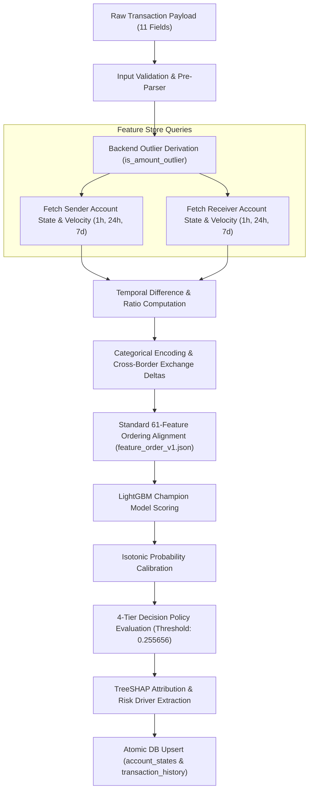

# 🔄 Sentinel Risk Engine — Feature Extraction & Real-Time ETL Pipeline

---

## 1. Executive Summary

The **Sentinel ETL Pipeline** bridges raw financial transaction payloads and real-time ML model inference. Given **11 raw transaction fields**, the pipeline executes feature transformations across temporal account histories, computes velocity metrics, evaluates currency exchange deltas, and standardizes an authoritative **61-feature vector** for LightGBM Champion model scoring.

---

## 2. Real-Time Pipeline Workflow



---

## 3. The 61-Feature Engineering Derivation Logic

The 61-feature vector is composed of 4 key domain feature groups:

### Group 1: Transaction Amount & Log Scaling (Features 1–12)
- **`Amount_Paid` & `Amount_Received`**: Raw outbound and inbound transaction values.
- **`amount_difference`**: Outbound minus inbound value ($| \text{Paid} - \text{Received} |$).
- **`amount_ratio`**: Inbound to outbound ratio ($\frac{\text{Amount\_Received}}{\text{Amount\_Paid} + 1e-6}$).
- **`log_amount`**: Natural log of payment amount ($\ln(\text{Amount\_Paid} + 1.0)$).
- **`is_amount_outlier`**: Strictly backend-derived flag ($1.0$ if $\text{Amount\_Paid} > \$10,000.0$ else $0.0$).

### Group 2: Account Velocity & Historical Aggregates (Features 13–35)
- **`sender_tx_count_1h`, `24h`, `7d`**: Transaction count for originating account over rolling temporal windows.
- **`receiver_tx_count_1h`, `24h`, `7d`**: Transaction count for destination account over rolling temporal windows.
- **`sender_amount_sum_24h`**: Total outbound amount transferred by sender in 24 hours.
- **`receiver_amount_sum_24h`**: Total inbound amount received by receiver in 24 hours.
- **`sender_amount_mean_24h`**: Mean transaction value for sender over 24 hours.
- **`sender_amount_std_24h`**: Standard deviation of transaction value for sender over 24 hours.
- **`time_since_last_tx_sender`**: Seconds elapsed since sender's previous transaction.
- **`time_since_last_tx_receiver`**: Seconds elapsed since receiver's previous transaction.

### Group 3: Categorical & Rail Risk Profiling (Features 36–48)
- **`Payment_Format` One-Hot Encodings**: Wire Transfer, ACH Outbound, Cheque, Credit Card, Cash Deposit.
- **`Payment_Currency` & `Receiving_Currency`**: ISO currency codes and cross-currency exchange flag (`is_cross_currency`).
- **`same_bank_flag`**: Binary indicator ($1.0$ if $\text{From\_Bank} == \text{To\_Bank}$ else $0.0$).

### Group 4: Cyclic Time Encodings (Features 49–61)
- **`hour_of_day_sin` / `cos`**: Sine and cosine transformations of transaction hour ($[0, 23]$).
- **`day_of_week_sin` / `cos`**: Sine and cosine transformations of day of week ($[0, 6]$).
- **`is_weekend`**: Binary weekend indicator ($1.0$ if Saturday/Sunday else $0.0$).

---

## 4. Pipeline Atomic Persistence & Thread Safety

To guarantee data consistency during concurrent API predictions, transaction history and account states are updated atomically:

```python
# Atomic Transaction Persistence Pattern
with repo._lock:
    conn = repo.db.connect()
    # 1. Insert Transaction History (Idempotent ON CONFLICT)
    cur.execute("""
        INSERT INTO transaction_history (...) VALUES (...)
        ON CONFLICT (transaction_key) DO NOTHING;
    """)
    # 2. Update Sender Velocity Aggregates
    cur.execute("""
        INSERT INTO account_states (account_id, transaction_count, total_amount_paid, ...)
        VALUES (%s, 1, %s, ...)
        ON CONFLICT (account_id) DO UPDATE SET
            transaction_count = account_states.transaction_count + 1,
            total_amount_paid = account_states.total_amount_paid + EXCLUDED.total_amount_paid;
    """, (from_acct, amt_paid))
    conn.commit()
```
