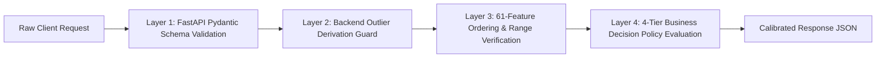

# 🛡️ Sentinel Risk Engine — Validation & Verification Framework

---

## 1. Executive Summary

The **Sentinel Validation Framework** defines the verification rules, payload guards, and contract integrity checks that guarantee deterministic, production-safe predictions across all transaction inputs.

---

## 2. Validation Layers

---

## 3. Detailed Validation Rules

### Layer 1: Pydantic Payload Contract Guard
- **`transaction_id`**: String, required, non-empty.
- **`Timestamp`**: Valid ISO 8601 string (`YYYY-MM-DDTHH:MM:SS`).
- **`From_Account` & `To_Account`**: Non-empty account strings.
- **`From_Bank` & `To_Bank`**: Non-empty institution strings.
- **`Amount_Paid` & `Amount_Received`**: Float64, strictly $> 0.0$.
- **`Payment_Format`**: Must belong to `['Wire Transfer', 'ACH Outbound', 'Cheque', 'Credit Card', 'Cash Deposit']`.
- **`Payment_Currency` & `Receiving_Currency`**: Must belong to `['USD', 'EUR', 'GBP', 'CAD', 'AUD']`.

### Layer 2: Outlier & Cross-Currency Derivation Guard
- **`is_amount_outlier`**: Automatically set to `1.0` if `Amount_Paid > 10000.0` else `0.0`.
- **`is_cross_currency`**: Automatically set to `1.0` if `Payment_Currency != Receiving_Currency` else `0.0`.
- **Client Contract Protection**: Client CANNOT pass `is_amount_outlier`, model probabilities, thresholds, or SHAP values.

### Layer 3: Feature Order & Schema Alignment
- Enforces strict 61-feature vector ordering matching `models/champion/feature_order_v1.json`.
- Missing historical account values default safely to $0.0$ or baseline median values.
